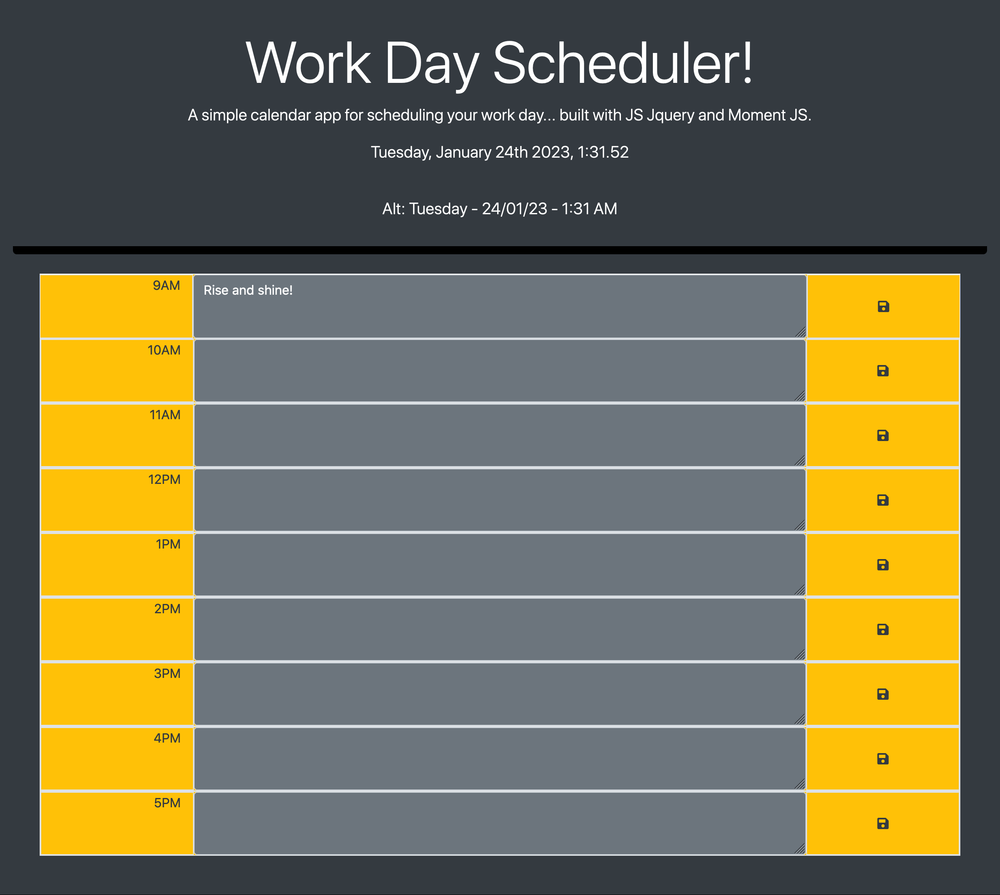

# Week 07 Challenge: Third-Party APIs: Daily Planner App

This Challenge will require me to leverage all the skills I've learned so far, requiring myself to think about DOM manipulation, advanced JavaScript, integration of third-party APIs, and more. This app will run in the browser and feature dynamically updated HTML and CSS powered by jQuery and Moment.js.

## Description

This project takes on the 7th week challenge which is creating a password generator app that runs on a web browser.

## User Story

💀💀💀
AS AN employee with a busy schedule
I WANT to add important events to a daily planner
SO THAT I can manage my time effectively
💀💀💀

### Essential information

## Links/Submission

* REPO: https://github.com/i-k-dev/challenge-week-7-planner
* PAGE: https://i-k-dev.github.io/challenge-week-7-planner/

## Acceptance Criteria

Critical requirements necessary to develop this password generator app that satisfies the grades:

* Display the current day at the top of the calendar when a user opens the planner. ✅
* Present timeblocks for standard business hours when the user scrolls down. ✅
* Color-code each timeblock based on past, present, and future when the timeblock is viewed. ✅
* Allow a user to enter an event when they click a timeblock. ✅
* Save the event in local storage when the save button is clicked in that timeblock. ✅
* Persist events between refreshes of a page. ✅
* Successfully creating a simple Javascript app (thanks JQuery!). ✅

## Screenshots

Preview of whole site:

## Author

Contributor names and contact info

Ishqha Khidzr  
@ this-github-user :-)

## Thanks